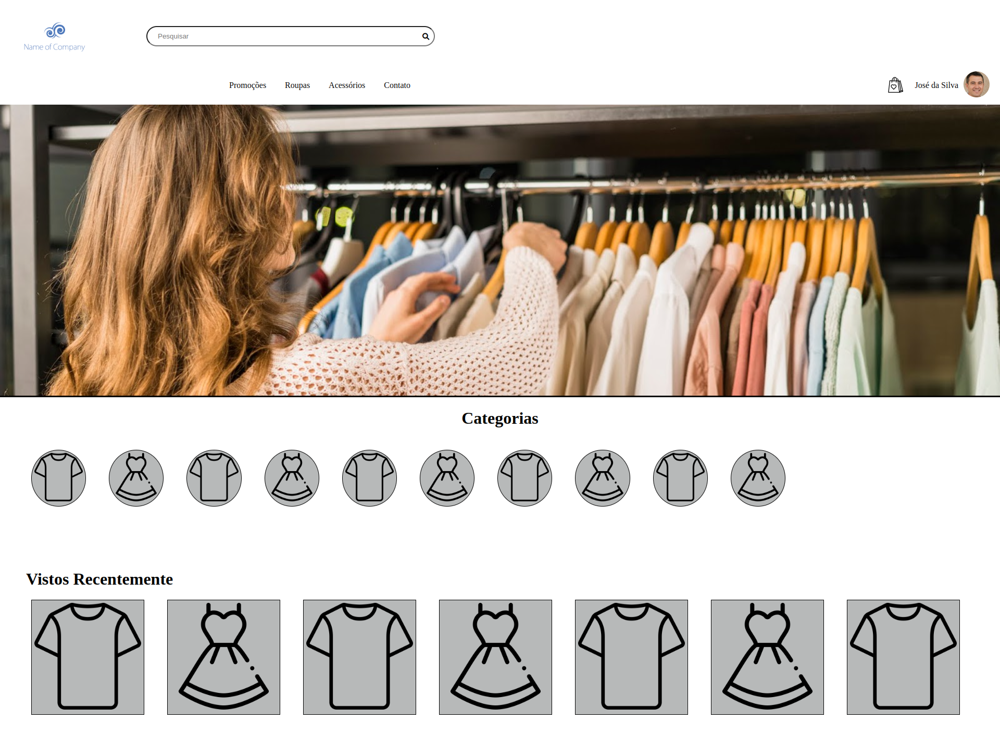
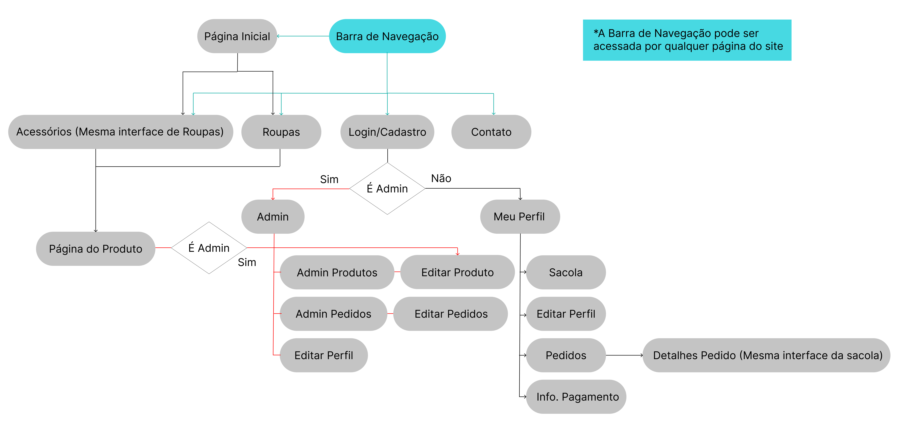

# Project Online Store

---

### Autores

Mateus Israel Silva - 11735042;

João Victor Dionizio - 12543912;

Pedro Liduino - 11796847;

---

Este projeto é um projeto realizado por estudantes da USP, o intuito do projeto é fazer um e-commerce, com objetivo de promover os conhecimentos adquiridos em aula.

Tivemos a ideia de fazer uma loja de roupas em que a pessoa usuária possa ter uma experiência de pré visualização de combinações de roupas diferentes;

Aqui você vai encontrar os detalhes sobre o desenvolvimento do projeto, habilidades envolvidas no desenvolvimento e lições aprendidas durante o processo.

---

---

## SUMÁRIO

- [Instruções para acessar o projeto](#instruções-para-acessar-o-projeto)
 -[Protótipo do Projeto](#protótipo-do-projeto)
- [Habilidades](#habilidades)
  - [Hard Skills](#hard-skills)
  - [Soft Skills](#soft-skills)
- [Objetivos](#objetivos)
- [Desenvolvimento](#desenvolvimento)
  - [Escolha da API's](#escolha-das-apis)
  - [Etapas](#etapas)
- [Requisitos](#requisitos)
  

    
Tela de Inicio

    <!-- - [Tela de Inicio](#tela-de-inicio) -->
  - [1. Criar um header](#1-criar-um-header)
  - [2. Criar um botão para página de pré visualização das roupas](#2-criar-um-botão-para-página-de-pré-visualização-das-roupas)
  - [3. Criar uma sessão de categorias](#3-criar-uma-sessão-de-categorias)
  - [4. Criar sessão de vistos recentemente](#4-criar-sessão-de-vistos-recentemente)
  

  

    
Tela de Contato

    <!-- - [Tela de Contato](#tela-de-contato) -->
  - [5. Criar um título](#5-criar-um-título)
  - [6. Criar uma área para o endereço da empresa](#6-criar-uma-área-para-o-endereço-da-empresa)
  - [7. Criar um mapa interativo](#7-criar-um-mapa-interativo)
  - [8. Criar um formulário](#8-criar-um-formulário)
  - [9. Criar botão de enviar o formulário](#9-criar-botão-de-enviar-o-formulário)
  

  

    
Tela de Produto

    <!-- - [Tela do Produto](#tela-do-produto) -->
  - [10. Foto do Produto](#10-foto-do-produto)
  - [11. Criar área de descrição do produto](#11-criar-área-de-descrição-do-produto)
  - [12. Preço do produto](#12-preço-do-produto)
  - [13. Criar botão  de adicionar ao carrinho](#13-criar-botão-de-adicionar-ao-carrinho)
  

  

    
Banco de Dados

    <!-- - [Banco de Dados](#banco-de-dados) -->
  - [14. Dados da pessoa usuária](#14-dados-da-pessoa-usuária)
  - [15. Dados da pessoa administradora](#15-dados-da-pessoa-administradora)
  - [16. Dados do produto](#16-dados-do-produto)
  

- [Lições Aprendidas](#lições-aprendidas)

---

# Instruções para acessar o projeto

1. Clone o repositório

- `git clone git@github.com:jvdionizio/group-14-project-online-store.git`
- Entre na pasta que você a acabou de clonar:
  - `cd group-14-project-online-store`

2. Instale as dependências e inicialize o projeto

- Instale as dependências:
  - `npm install`

### Protótipo do Projeto

  Para acessar o diagrama e os exemplos de páginas que fizemos com do projeto finalizado basta entra [neste link](https://www.figma.com/file/8BWRa4qGzv9NQUM9XwFAVU/P%C3%A1gina-modelo?node-id=2%3A13)

---

## Habilidades

### Hard Skills

- Fazer requisições a uma API *(Application Programming Interface)*;
- Utilizar conhecimentos sobre JavaScript, CSS e HTML;
- Trabalhar com funções assíncronas;
- Utilizar Formulários;

### Soft Skills

- Negociação
- Escuta Ativa
- Comunicação Assertiva
- Criatividade

---

## Objetivos

- Fazer uma interface dentro dos padrões de mercado.
- Entregar uma pré visualização de combinação de roupas
- Fácil interação do usuário com o sistema de busca.
- Design único, responsivo e bonito.

---

# Desenvolvimento

### Escolha das API's

Escolhemos as API's e plataformas procurando dar uma melhor experiência ao usuário então escolhemos:

- Google Maps Platform : Disponibiliza um mapa na tela, dando a pessoa usuária noções mais claras de organização.

### Etapas

- Fazer exemplos gráficos das paginas da aplicação no [figma](https://www.figma.com/file/8BWRa4qGzv9NQUM9XwFAVU/P%C3%A1gina-modelo?node-id=2%3A13)
- Definir requisitos
- Ler a documentação das API's
- Fazer as funções responsáveis pela requisição nas API's
- Fazer a páginas em html.
- Manipular o DOM.
- Design da página pelo CSS

### Diagrama de Navegação

## Requisitos

Além dos requisitos pré estabelecidos pelo professor definimos alguns outros requisitos baseados em nossos objetivos e em nosso exemplo gráfico

### Tela de Inicio

#### 1. Criar um header

- O header deve conter uma imagem com o logo da loja com a classe `logo`
- Deve conter uma barra de navegação entre as páginas
- Um link para o carrinho de compras
- Uma foto de perfil do usuário, para que ele possa editar seu perfil
  
#### 2. Criar um botão para página de pré visualização das roupas

- Deve estar sempre visível na página inicial
- Deve ter a classe `dresser`
- Deve estar posicionado fixo e a direita da tela

#### 3. Criar uma sessão de categorias

- As categorias devem ser disponibilizadas em imagens
- As categorias devem estar dispostas em uma lista não ordenada `ul`
- A lista deve ter a classe `categorias`

#### 4. Criar sessão de vistos recentemente

- Os itens devem ser disponibilizadas em imagens
- Os itens devem estar dispostas em uma lista não ordenada `ul`
- A lista deve ter a classe `vistos-recentemente`

### Tela de Contato

#### 5. Criar um título

- Deve estar uma tag `h1`
- Deve ter o id `title`
- Deve conter o texto "Contato"

#### 6. Criar uma área para o endereço da empresa

- Deve ter a classe `adress`

#### 7. Criar um mapa interativo

- O mapa deve ser o retornado pela API do Google Maps Platform
- Deve ser interativo
- Não deve ter barra de busca

#### 8. Criar um formulário

- O formulário deve conter uma `label` para cada um de seus inputs, selects ou textareas
- Deve ter 2 inputs com os ids: `name` e `email` respetivamente
- Deve conter um select com o id `about`, para que o usuário possa selecionar o motivo do contato
- Deve conter uma textarea com o id `description` para que a pessoa usuária possa descrever o ocorrido

#### 9. Criar botão  de enviar o formulário

- Deve ser da tag `button`
- Deve conter o texto "Enviar"

### Tela do Produto

#### 10. Foto do Produto

- Deve ter o id `product-img`

#### 11. Criar área de descrição do produto

- Deve possuir a classe `description`

#### 12. Preço do produto

- Deve possuir a classe `preco`

#### 13. Criar botão  de adicionar ao carrinho

- Deve ser da tag `button`
- Deve conter o texto "Adicionar ao Carrinho"

### Banco de Dados

#### 14. Dados da pessoa usuária

- Deve conter um objeto contendo as seguintes informações da pessoa física:
  - CPF
  - Nome
  - Sobrenome
  - Email
  - Senha

#### 15. Dados da pessoa administradora

- Deve conter um objeto contendo as seguintes informações de pessoa jurídica:
  - CNPJ
  - Nome da loja
  - Telefone
  - Email
  - Senha

#### 16. Dados do produto

- Deve conter um objeto contendo as seguintes informações do produto:
  - Nome do produto
  - Descrição de produto
  - Preço
  - Loja responsável
  - Imagem do Produto (sem fundo)

---

## Lições Aprendidas

- Manipular mapas e os elementos dentro de um mapa;
- Fazer brainstorms;
- Organizar reuniões periódicas;
- Organizar melhor branch's e commits.
